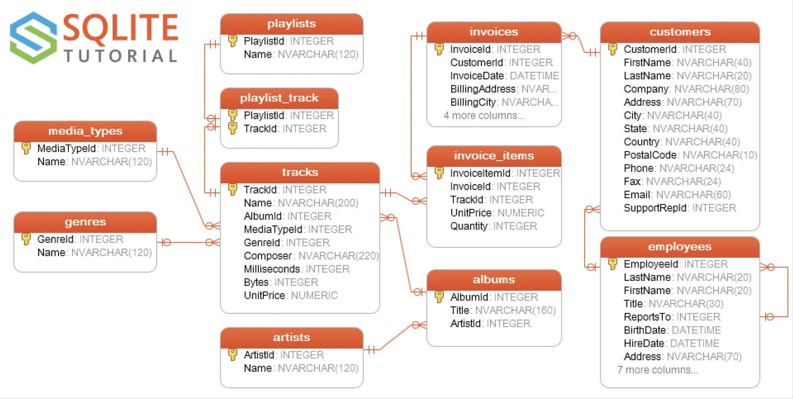

# FastAPI Presentation

# Introduction

This repository contains the FastAPI application I created for a presentation I gave at work. My goal for this repository is to make it a useful tool to help developers get up to speed with the FastAPI framework to create APIs.

# FastAPI

## What Is FastAPI

FastAPI is a modern, high-performance web framework for building APIs with Python. It is an asynchronous framework that can handle many requests concurrently. It also takes good advantage of type hints to aid with development.

## Why Use FastAPI

The framework has many attractive features:

1. It has very high performance, comparable to NodeJS and Go
2. Developers gain coding performance improvements
3. Editors and IDEs have great support for FastAPI
4. It's a robust platform for creating production-ready code
5. Based on open standards for APIs, OpenAPI, previously known as Swagger

## Who Is Using FastAPI

Companies like Microsoft, Uber, Netflix, Expedia Group, and Cisco use FastAPI.

# Example Application

The code making up the bulk of this repository is a FastAPI web application that creates CRUD REST APIs to access a database. Rather than create a database from scratch, I used the [Chinook database](https://www.sqlitetutorial.net/sqlite-sample-database/) from the [SQLite Tutorial](https://www.sqlitetutorial.net/) website. This is a great resource to learn SQL and has a download link to the database.

I used the Chinook SQLite database for a couple of reasons:

1. I didn't have to build a database and populate it with data, which was a time-saver.
2. Because it's an "in process" database engine, it wasn't necessary to set up and configure another database engine, like MySQL, PostgreSQL, or SQL Server.
3. The database has tables with one-to-many, many-to-many, and self-referential hierarchical tables, which I used to display FastAPIs abilities.

The ERD (Entity Relationship Diagram) of the database looks like this:

 

## REST Conventions

REST is more of a convention than a standardized protocol, and I used my conventions to create the REST URL endpoints.

The endpoints define a collection of "things" and access to a single "thing." Because they are things, nouns are used as names. I am careful when naming things to avoid awkward plural and singular nouns.

The CRUD behaviors are mapped to these HTTP method verbs:

| CRUD Method | HTTP Method | URL Endpoint        | Action on a thing                                            |
| :---------- | ----------- | ------------------- | ------------------------------------------------------------ |
| Create      | POST        | /api/v1/things      | Create new thing                                             |
| Read        | GET         | /api/v1/things      | Read a collection of things                                  |
| Read        | GET         | /api/v1/things/{id} | Read singular thing from the collection as a URI (Universal Resource Identifier) |
| Update      | PUT         | /api/v1/things/{id} | Update entire thing                                          |
| Update      | PATCH       | /api/v1/things/{id} | Partially update thing                                       |

> [!NOTE]
>
> In this application, there is no Delete functionality. It's generally a bad idea to delete data from a database. I prefer to have something like an `active` flag that can be True or False to include or exclude the item from the interface. To do this would have meant modifying the Chinook database to add an `active` flag. Doing that would have made it more difficult to reset the database back to its default state, so I chose not to add delete functionality to the API.

## SQLModels

To reduce code duplication, the SQLModel library interacts with the database and combines SQLAlchemy and Pydantic nicely. Here is the `albums` table schema as defined by the database:

```sql
create table albums
(
    AlbumId  INTEGER       not null
        primary key autoincrement,
    Title    NVARCHAR(160) not null,
    ArtistId INTEGER       not null
        references artists
);


create index IFK_AlbumArtistId
    on albums (ArtistId);
```

This nicely describes the `albums` table schema and shows it contains a primary key named `AlbumIId`, a `Title` string 160 characters long, and a foreign key called `ArtisId` that references the primary key of another table called `artists`. It also creates an index on the `ArtistId` column to improve performance on join operations.

This works fine, but I want to change how my application works with the table without changing the `albums` table schema.

* I don't care for the naming convention used in the Chinook database for column names, and I'll map them to the naming conventions I prefer.
* In particular, I like to use just `id` for the primary key name. The above schema creates a primary key name like this`albums.AlbumId` , which I feel is redundant. I prefer this `albums.id`. Doing this also lets me recognize foreign keys quickly as they would be in this form for the `albums` table: `albums.artist_id`.

```python
from typing import Optional, List
from functools import partial

from sqlalchemy import Column, Integer, Index, ForeignKey
from sqlmodel import SQLModel, Field, Relationship
from pydantic import ConfigDict

from .fields import ValidationConstant, create_string_field

# create a specialized sqlmodel Field class that provides validation for the album title
TitleField = partial(
    create_string_field,
    "Album Title",
    "The title of the album",
    ValidationConstant.STRING_160,
)


class AlbumBase(SQLModel):
    """
    This is the base class for the Album model. All fields that are common to
    any derived classes are defined here.
    """
    title: str = TitleField(mapped_name="Title")
    artist_id: int = Field(
        sa_column=Column("ArtistId", Integer, ForeignKey("artists.ArtistId")),
    )


class Album(AlbumBase, table=True):
    """
    This is the Album model class. It represents an album in the database.
    It inherits from AlbumBase and is mapped to the "albums" table in the database.
    Notice the id primary key is marked as Optional, this is because the id is 
    not provided by the user, it is generated by the database. Notice too the
    artist and tracks relationships, these are defined as lists of objects. These
    values don't exist in the database but are used to represent the related
    objects, and are populated by SQLAlchemy when the object is read from the
    database as part of an ORM operation.
    """
    __tablename__ = "albums"

    id: Optional[int] = Field(
        default=None,
        sa_column=Column("AlbumId", Integer, primary_key=True),
        description="The unique identifier for the album",
    )
    # Define the relationship to Artist
    artist: "Artist" = Relationship(back_populates="albums")

    # Define the relationship to Tracks
    tracks: List["Track"] = Relationship(back_populates="album")

    model_config = ConfigDict(from_attributes=True)

    # make the model aware of the index on the artist_id column
    __table_args__ = (Index("IFK_AlbumArtistId", "ArtistId"),)


# Create operation
class AlbumCreate(AlbumBase):
    pass


# Read operation
class AlbumRead(AlbumBase):
    id: int

    model_config = ConfigDict(from_attributes=True)


# Update operation (Put)
class AlbumUpdate(AlbumBase):
    pass


# Patch operation
class AlbumPatch(AlbumBase):
    title: Optional[str] = TitleField(default=None)


from .artists import Artist  # noqa: E402
from .tracks import Track  # noqa: E402
```

### The Other Models

Here is a list of the other sqlmodels in the application:

1. albums - which was covered about. This has all the albums in the database, and is related to artists
2. artists - This has all the artists in the database and is the parent of the albums models.
3. customers - This has all the customers in the system and holds all the customer information; name, address, etc.. It has a parent relationship to invoices.
4. invoices - This has the order invoices for what has been purchased and has a child relationship with customers.
5. invoice_items - This has all the items that make up an invoice and has a child relationship with invoices. It also has a child relationship with tracks.
6. tracks - This has all the track information about a song, like a composer, length, size in bytes, etc.. 
7. genres - This contains genre or music type and has a parent relationship with tracks.
8. media_type - This contains information about how the music is encoded, such as MPEG, AAC, etc., and has a parent relationship with tracks.
9. playlists - This contains the name of a playlist and has a many-to-many relationship with tracks
10. playlist_track - This association table creates the many-to-many relationship between playlists and tracks.
11. employees - This is a hierarchal table holding all the employees in the application and the **reports-to** relationships between them. It also has a parent relationship with customers.

The sqlmodel definitions follow patterns similar to those of `albums` described above. The differences account for the different fields in each table and their relationships.

## URL Endpoint Routes

### Creating A Route

Because of the naming conventions I used on the sqlmodel classes and the mapping applied to the database fields, it was possible to create generic route handling for most of the REST functionality I wanted in the application. I'll try to illustrate this by working backward from the generic `create_item_route` route function to where the the route is added to FastAPI. Here is the code of the `create_item_route` route function:

```python
def create_item_route(
    router: APIRouter,
    model: ModuleType,
):
    """
    Create the generic create item route in the router parameter for
    the model parameter
    """
    # takes advantage of the plural/singular naming conventions
    prefix, prefix_singular, class_name = get_model_names(model)

    @router.post(
        "/",
        response_model=CombinedResponseCreate[getattr(model, f"{class_name}Read")],
        status_code=status.HTTP_201_CREATED,
    )
    async def create_item(
        data: getattr(model, f"{class_name}Create"),
        db: AsyncSession = Depends(get_db),
    ):
        """
        The generic create item (class_name) for the route
        
        :params data: the Create sqlmodel definition
        :db AsyncSession: the asynchronous database session to use
        """
        async with db as session:
            db_item = await crud.create_item(
                session=session,
                data=data,
                model_class=getattr(model, f"{class_name}"),
            )
            if db_item is None:
                raise HTTPException(
                    status_code=400,
                    detail=f"{class_name} already exists",
                )
            return CombinedResponseCreate(
                meta_data=MetaDataCreate(),
                response=db_item,
            )
```

This function initially generates the prefix, prefix_singular, and class name from the `model` parameter. The `get_model_names()` function capitalizes on the naming convention to generate these values from the `model`. The route POST operation (the CRUD Creation HTTP method) decorates the nested `create_item` handler function mapped to the endpoint URL. 

The remainder of the function is pretty standard asynchronous code to create an item in the database. It uses the `getattr` function to get the actual model class from the `class_name` string. It calls the `crud.create_item` method to interact with the database and persist the item to the database. The `crud.*` methods are shown later in this document.

The other routes to read a collection of items, read a single item, update an item, and partially update an item all follow the same pattern.

By doing this, the application can pass any module containing a sqlmodel definition that follows the naming convention, and a complete CRUD route will be created.

### Building A Route

The function`build_routes` creates the complete set of routes for a model. That function is shown here:

```python
def build_routes(
    model: ModuleType,
    child_models: List[ModuleType],
) -> APIRouter:
    """
    This function builds all the CRUD routes for the passed
    in model (artist, albums, etc.). It creates a router for
    all the CRUD routes, and passes that and the model to
    functions to create the different routes.
    
    :params ModuleType: the module containing the model definitions
    :params List[ModuleType]: the list of modules containing child model definitions
    :returns APIRouter: a populated router FastAPI will handle
    """
    # takes advantage of the plural/singular naming conventions
    prefix, _, _ = get_model_names(model)
    tags = prefix.title().replace("_", " ")

    # create a router for the model
    router = APIRouter(
        prefix=f"/{prefix}",
        tags=[f"{tags}"],
        responses={404: {"description": "Not found"}},
        dependencies=[Depends(get_db)],
    )
    # create the endpoint routes
    params = {
        "router": router,
        "model": model,
    }
    create_item_route(**params)
    get_items_route(**params)
    get_item_route(**params)
    update_item_route(**params)
    patch_item_route(**params)
    
    # add the child modules for the specialized children routes
    params.update({"child_models": child_models})
    children.get_routes(**params)
    return router
```

The `build_routes` function takes in a `model` ModuleType and any `child_models` related to the `model`. It generates an instance of the `router` all of the CRUD methods will attach to. Then each CRUD creation function is called, in turn, receiving the `router` and the `model` to use. 

It also calls the `children.get_routes` function to create the children routes. This handles routes like this:

`/api/v1/things/{id}/children_things`

I haven't figured out a way to make these generic because some of the children routes use many-to-many relationships or are built using hierarchical tables. Hopefully, I'll get some time to work this out and update the repository when I do. Until then, oh well.

## Serving The Routes

At a high level, a FastAPI application serves the routes it knows about. This application is no different, except the routes are created from a data structure instead of individually. This is handled by the `main.py` code by two functions, `app_factory` and `get_routes_config`. The first, `app_factory` creates the FastAPI `app` instance that `uvicorn` runs to get the application moving. Most of the code is focused on initializing the `fastapi_app` instance and adding some middleware. The last part is a loop that iterates over what's returned by `get_routes_config` and uses that to add routes to the `fastapi_app` instance using the `build_routes` function shown above.

```python
def app_factory():
    """
    Creates the FastAPI application object and configures
    it for CORS

    :return: FastAPI application object
    """
    fastapi_app: FastAPI = FastAPI(
        title="FastAPI Presentation API",
        description=__doc__,
        version="1.0.0",
        openapi_url="/openapi.json",
        lifespan=lifespan,
        debug=True,
    )

    # add CORS middleware
    fastapi_app.add_middleware(
        CORSMiddleware,
        allow_origins=["*"],
        allow_credentials=True,
        allow_methods=["*"],
        allow_headers=["*"],
    )
    fastapi_app.add_middleware(BaseHTTPMiddleware, dispatch=log_middleware)
    fastapi_app.add_middleware(MetadataMiddleware)

    # add all the endpoint routes
    for route_config in get_routes_config():
        fastapi_app.include_router(build_routes(**route_config), prefix="/api/v1")

    return fastapi_app


def get_routes_config() -> Dict:
    """
    Returns all the routes configuration for the application

    :return: Dict of router info
    """
    return [
        {"model": artists, "child_models": [albums]},
        {"model": albums, "child_models": [tracks]},
        {"model": tracks, "child_models": [invoice_items, playlists]},
        {"model": genres, "child_models": [tracks]},
        {"model": media_types, "child_models": [tracks]},
        {"model": playlists, "child_models": [tracks]},
        {"model": invoices, "child_models": [invoice_items]},
        {"model": invoice_items, "child_models": []},
        {"model": customers, "child_models": [invoices]},
        {"model": employees, "child_models": [customers, employees]},
    ]


# Initialize and create the application
app = app_factory()
```

The `get_routes_config` returns a list of dictionaries with the keys `model` and `child_models`. The `model` value is the module's name containing the sqlmodel definitions for the database tables and the mappings applied. For example, the model `artists` refer to the `project/app/models/artists.py` Python module. The `child_models` key value is a list of models associated with the model as children. For example, the `artists` model has `[albums]` because of the one-to-many relationship between `artists` and `albums`.

This lets the loop that iterates over what `get_routes_config` returns and passes that to `build_routes` to build the routes dynamically. This means that if more tables were added to the database, so long as the sqlmodel classes defined for that table followed the naming conventions used, that table could be added to the routes by including it as a data structure in `get_routes_config`.

### Creating A Route

Each route created by the `build_routes` function is handled by a generic function. I've included the `create_item_route` function here as an example that sets the pattern for the others:

```python
def create_item_route(
    router: APIRouter,
    model: ModuleType,
):
    """
    Create the generic create item route in the router parameter for
    the model parameter
    """
    # takes advantage of the plural/singular naming conventions
    prefix, prefix_singular, class_name = get_model_names(model)

    @router.post(
        "/",
        response_model=CombinedResponseCreate[getattr(model, f"{class_name}Read")],
        status_code=status.HTTP_201_CREATED,
    )
    async def create_item(
        data: getattr(model, f"{class_name}Create"),
        db: AsyncSession = Depends(get_db),
    ):
        """
        The generic create item (class_name) for the route
        
        :params data: the Create sqlmodel definition
        :db AsyncSession: the asynchronous database session to use
        """
        async with db as session:
            db_item = await crud.create_item(
                session=session,
                data=data,
                model_class=getattr(model, f"{class_name}"),
            )
            if db_item is None:
                raise HTTPException(
                    status_code=400,
                    detail=f"{class_name} creation failed",
                )
            return CombinedResponseCreate(
                meta_data=MetaDataCreate(),
                response=db_item,
            )
```

The `create_item_route` creates the route using the `router` passed to it and defines the response it will return. The `@router.post` decorates the nested `create_item` function, the Create activity handler function. The parameters to this function are `data,` which is the intended model's Create class, and `db`, the asynchronous database connection.

The model Create data instance is passed to the `crud.create_item` function to create the new item and persist it to the database. The `db_item` is the item in the database updated with the primary_key `id` value of the newly created item. This is returned in an instance of the `CombinedResponseCreate` class. The `CombinedResponseCreate` class, part of how meta_data is attached to the response, will be shown later in this document. 

### Exceptions

As mentioned, I haven't yet figured out how to make the children routes generic. For those routes, I created individual routes that also included interaction with the database to save some time. For example, I'll show the track to playlist handler, which uses the many-to-many relationship between tracks and playlists.

```python
def _child_track_playlist_handler(router: APIRouter):
    @router.get(
        path="/{id}/playlists",
        response_model=CombinedResponseReadAll[List[PlaylistRead], int],
    )
    async def read_track_playlists(
        id: int,
        offset: int = 0,
        limit: int = 10,
        db: AsyncSession = Depends(get_db),
    ) -> [List[PlaylistRead], int]:
        """
        Retrieve a Track from the database with a paginated
        list of associated playlists
        """
        async with db as session:
            query = (
                select(Playlist)
                .join(
                    PlaylistTrack, PlaylistTrack.playlist_id == Playlist.id
                )  # Join Playlist to playlist_track
                .join(
                    Track, PlaylistTrack.track_id == Track.id
                )  # Join playlist_track to Track
                .where(Track.id == id)  # Filter by the track ID
                .order_by(Playlist.id)
                .offset(offset)
                .limit(limit)
            )
            # Execute the query
            result = await session.execute(query)
            db_playlists = result.scalars().all()

            # Query for total count of playlists
            count_query = (
                select(func.count(Playlist.id))
                .join(
                    PlaylistTrack, PlaylistTrack.playlist_id == Playlist.id
                )  # Join Playlist to playlist_track
                .join(
                    Track, PlaylistTrack.track_id == Track.id
                )  # Join playlist_track to Track
                .where(Track.id == id)
            )
            total_count = await session.scalar(count_query)

            playlists = [
                PlaylistRead.model_validate(db_playlist) for db_playlist in db_playlists
            ]

            return CombinedResponseReadAll(
                response=playlists,
                total_count=total_count,
            )
```

The `_child_track_playlist_handler` is passed the `router` created for `tracks`. There's nothing generic about this code; it knows specific information about the models and relationships to use to get the data. It retrieves the playlist data using the `PlaylistTrack` association table.

It does another query to get the `total_count` of playlists related to the track. This is pagination information that is part of the meta_data included in the response.

Notice the use of `offset` and `limit` in the `query`. This means the resulting endpoint URL:

`ap/v1/tracks/{id}/playlists?offset=0&limit=20`

applies the `offset` and `limit` to the `playlists` collection and not the `tracks` collection.

## CRUD Operations

The database CRUD operations are also handled by generic functions that do the right thing based on the model they are passed. Here is the `create_item` function. The rest of the functions in the `crud.py` module follow similar patterns:

```python
async def create_item(
    session: AsyncSession,
    data: InputType,
    model_class: Type[InputType],
) -> OutputType:
    """
    Create a new item in the database.
    Returns the created item as the same class.
    """
    if not inspect.isclass(model_class):
        raise ValueError("model_class must be class object")

    db_item = model_class(**data.model_dump())
    session.add(db_item)
    await session.commit()
    await session.refresh(db_item)
    return db_item
```

If you recall from the route function, what's passed to the crud functions is the sqlmodel table class—for example, `Artist`, not `ArtistCreate`, `ArtistRead,` or any other variations. This is because the crud functions only deal with the database items, and that's what they return, or an exception if there's a problem.

If we look at this example in the case where `InputType` is `Artists`, the `data` parameter is of type `Artist`. The line of code:

```python
db_item = model_class(**data.model_dump())
```

will instantiate an `Artist` model with the data supplied. The `db_item` is added to the database `session`, committed, and refreshed to get any database-supplied information. In this case, the auto-incremented primary_key `id` value.

## Separation Of Concerns

The routes all return a `*Read` model or a `List[*Read]` model, for example, `AristRead` or `List[ArtistRead]`in the `CombinedResponse*` class instance. The crud functions all return database-specific models, like `Artist`. This is intentional. The routes return a presentation of the data. For this application, that presentation is JSON data. The crud functions return database model instances or collections of the same. 

The crud functions make no assumptions about how the data will be used. This means other application functionality can call the crud functions and interpret and present it any way those functions see fit. Here's a simplistic example of what I mean:

```python
# bad functionality
def add_two_numbers(a, b):
  total = a + b
  print(f"The total is {total}")
  
# bad usage, no way to get the result, and output is sent to STDOUT
add_two_numbers(10, 12)

# better functionality
def add_two_numbers(a, b):
  return a + b

# better usage, the total is returned, and that can be used in any way desired
total = add_two_numbers(10, 12)
print(f"The total is {total}")
```

My intended use case for this distinction between data and presentation is a future project/presentation about [HTMX](https://htmx.org/). The FastAPI application will be enhanced to serve HTMX endpoints, creating a SPA (Single Page Application) style of interface for the user.

# MetaData

I like the REST way of thinking about an API. The actions (verbs) are the HTTP methods to access a thing (noun) uniquely identified by the URL. However, there are some places where this gets awkward. 

One minor one is creating a new thing. When a new thing is created, the response returns the unique id for the newly created thing. This is great and necessary so a user or application accessing the API can access the newly created thing with other API endpoints. But, it might be helpful if the API could return the URL of the newly created thing. 

I think a bigger problem is handling collections of things. An API endpoint like this: `api/v1/things` returns a collection. In any reasonably sized database, the collection of "things" could be pretty large. This example application handles that by providing `offset` and `limit` query string parameters with default values of 0 and 10, respectively. The response from the endpoint is a list of things constrained by the `offset` and `limit` values. However, it doesn't tell you anything about the total size of the collection or how to paginate it in a presentation.

This is an opportunity to include metadata about the data in the API response. The metadata about a response would vary depending on the response. For example, a create thing response metadata would include location information about the newly created thing's API URL. A collection of things response metadata would consist of pagination information about the collection: current page number, the total number of pages based on the `offset` and `limit`, and the total number of things in the collection.

This is where the `MetaData*` and  `Combined*` class models, as well as custom middleware, come into play in the example application.

## MetaData Classes

The `MetaData*` model classes create the metadata structure to include with each kind of response, create, read, etc. They are contained in the `models/metadata.py` file and look like this:

```python
class MetaData(BaseModel):
    status_code: int = Field(
        default=HTTPStatus.OK.value,
        description="HTTP status code",
    )
    message: str = Field(
        default=HTTPStatus(HTTPStatus.OK.value).description,
        description="HTTP status message description",
    )

class MetaDataCreate(MetaData):
    location: HttpUrl = Field(
        default="https://example.com", description="Location of the created resource"
    )

class MetaDataReadAll(MetaData):
    page: int = Field(default=0, ge=0, description="Current page number")
    page_count: int = Field(default=0, ge=0, description="Total number of pages")
    offset: int = Field(default=0, ge=0, description="Offset value")
    limit: int = Field(default=0, ge=0, description="Limit value")
    total_count: int = Field(default=0, ge=0, description="Total number of records")

class MetaDataReadOne(MetaData):
    pass

class MetaDataUpdate(MetaData):
    location: HttpUrl = Field(
        default="https://example.com", description="Location of the created resource"
    )

class MetaDataPatch(MetaData):
    location: Optional[HttpUrl] = Field(
        default="https://example.com", description="Location of the created resource"
    )
```

The `MetaData` model defines the base class the others derive from so they all get the `status_code` and `message` fields. This is probably redundant since the API endpoints return the status code, but what the heck, I thought it might be useful. Plus, it gives us a place to put any other data that is common to the other model definitions.

The `MetaDataCreate` class has a `location` field. This will have the API URL of newly created things in the database.

The `MetaDataReadAll` class has pagination information useful for APIs that return a collection of things.

The `MetaData*` classes are used to create the metadata alongside an API response. Connecting the metadata to a response is the job of the `Combined*` models.

## Combined Classes

The `Combined*` classes connect the MetaData* and API response classes to create a single, unified response. In general, an API endpoint of the example application returns a response structured like this:

```json
{
  "meta_data": "<meta data class instantiation>",
  "response": "<data the API endpoint returns>"
}
```

I used `meta_data` in the response because FastAPI reserves "metadata" (no underscore). Since each endpoint can return different a metadata and response structure, the `Combined*` classes make use of Python generics.

```python
from .metadata import (
    MetaDataCreate,
    MetaDataReadAll,
    MetaDataReadOne,
    MetaDataUpdate,
    MetaDataPatch,
)

T = TypeVar("T")
U = TypeVar("U")

class CombinedResponseCreate(BaseModel, Generic[T]):
    meta_data: MetaDataCreate = MetaDataCreate()
    response: T

class CombinedResponseReadAll(BaseModel, Generic[T, U]):
    meta_data: MetaDataReadAll = MetaDataReadAll()
    response: T
    total_count: U

class CombinedResponseRead(BaseModel, Generic[T]):
    meta_data: MetaDataReadOne = MetaDataReadOne()
    response: T

class CombinedResponseUpdate(BaseModel, Generic[T]):
    meta_data: MetaDataUpdate = MetaDataUpdate()
    response: T

class CombinedResponsePatch(BaseModel, Generic[T]):
    meta_data: MetaDataPatch = MetaDataPatch()
    response: T
```

Each of the `Combined*` classes creates a default `MetaData*()` instance. The instantiated `MetaData*` class will be initialized by the middleware code coming up. The response will be whatever type is supplied by the route definition. Here's the `read_item` route definition to show how this is used:

```python
    @router.get(
        "/{id}",
        response_model=CombinedResponseRead[getattr(model, f"{class_name}Read")],
    )
    async def read_item(
        id: int = Path(..., title=f"The ID of the {prefix} to get"),
        db: AsyncSession = Depends(get_db),
    ):
        async with db as session:
            db_item = await crud.read_item(
                session=session,
                id=id,
                model_class=getattr(model, f"{class_name}"),
            )
            if db_item is None:
                raise HTTPException(
                    status_code=404,
                    detail=f"{class_name} not found",
                )
            item_read = getattr(model, f"{class_name}Read")
            return CombinedResponseRead(response=item_read.model_validate(db_item))
```

The route response model is `CombinedResponseRead` and is passed the model `*Read` class definition, which is used by the `CombinedResponseRead` class as the `Generic[T]` type.

The route returns an instance of `CombinedResponseRead` initialized with a validated instance of the `db_item`.

## Middleware

What is returned by the application routes is an instance of one of the `Combined*` classes, with the `response` part filled in and the `meta_data` part present but empty. To initialize the `meta_data,` the application has custom middleware to intercept the responses and populate the `meta_data` appropriately. The `app/middleware.py` module handles this. I won't include the contents of that file here as it's lengthy, and you can see it in the respository.

That code has one primary function: to intercept the requests, get the response from the routes, and update the `meta_data` part of the response with the correct metadata for the type of request and the response structure.

# Installation

# Running The Application

# Resources

[FastAPI Documentation](https://fastapi.tiangolo.com/)

[SQLite Tutorial](https://www.sqlitetutorial.net/)

This is a [YouTube](https://www.youtube.com/watch?v=pkILKAHScrc) video of a presentation I gave to a Python Users group about asynchronous coding. The first half is that presentation.


